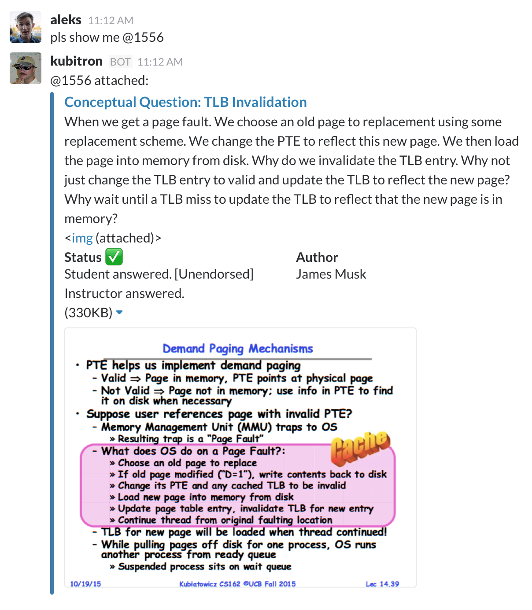

# [hubot-piazza-slack](https://www.npmjs.com/package/hubot-piazza-slack)

Unfurls Piazza post references, like @1234. [See screenshot below.](#screenshot)

See [`src/piazza-slack.coffee`](src/piazza-slack.coffee) for full documentation.

## Installation

In hubot project repo, run:

`npm install hubot-piazza-slack --save`

Then add **hubot-piazza-slack** to your `external-scripts.json`:

```json
[
  "hubot-piazza-slack"
]
```

## Prerequisites

Ensure that your server (e.g. Heroku) has a version of Node.js that is `>= 4.1.0`. You can check your local version via `node -v`. Run `heroku run node -v` to determine the Node version on your Heroku app.

## Configuration

You need to set these three environment variables where you run Hubot.

- `HUBOT_PIAZZA_CLASS_ID`: the ID of your Piazza class, found at the end of a piazza URL (e.g. last part of https://piazza.com/class/idmcvkolvsn7p0)
- `HUBOT_PIAZZA_EMAIL`: email to auth with Piazza
- `HUBOT_PIAZZA_PASS`: password to auth with Piazza (plaintext, be wary about who sees this!)

## Sample Interaction

<a name="screenshot"></a>

